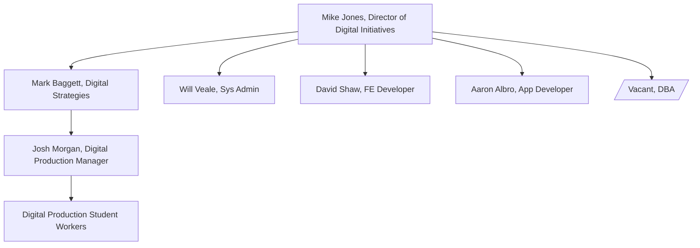

# Welcome and About

Digital Initiatives at the University of Tennessee Libraries collaborates with other departments to:

* provide technical infrastructure for servers, repository systems, and the Libraries website
* create digital files from physical materials according to best practices in digital preservation
* describe and create schemas for description for cultural heritage materials and items in our institutional repository
* oversee digital assets management, repository administration, and ongoing digital preservation procedures
* develop custom applications and provide technical solutions for complex problems
* create appealing web interfaces for the Libraries various web applications
* develop technical solutions in support of VOL Journals

## People

### Who We Are

Digital Initiatives
* [Aaron Albro](https://github.com/di-aaron), Application Developer
* [Mike Jones](https://github.com/mkaljns), Director of Digital Initiatives
* [Josh Morgan](https://github.com/kidon0011), Digital Production Manager
* [David Shaw](https://github.com/dshaw11), Frontend Developer
* [Will Veale](https://github.com/tedfa), Systems Administrator

Special Collections - Partner
* [Meredith Hale](https://github.com/mlhale7), Metadata Librarian

### Org Chart

### Alumni and Alumnae

These people have moved on to new jobs and new careers but made significant contributions to our team in the past.

* [Bridger Dyson-Smith](https://github.com/canofbees)
* [Don Richards](https://github.com/DonRichards)
* [Mat Jordan](https://github.com/mathewjordan/)
* [Mark Baggett](https://github.com/markpbaggett)
* [Sarah Funk](https://github.com/sfunk3)
* [Paul Cummins](https://github.com/pc37utn)

## Related Organizations

### [UTK Metadata](https://github.com/UTKcataloging/)

While members of our group have responsibility for creating descriptive metadata, this is kept in a this organizational
GitHub account.

### [Digital Library of Tennessee](https://github.com/DigitalLibraryofTennessee/)

Members of Digital Initiatives are responsible for the technical infrastructure related to the aggregation activities of
the Digital Library of Tennessee.  Because this work is multi-institutional, we keep applications and code related to 
this work in this organization.
